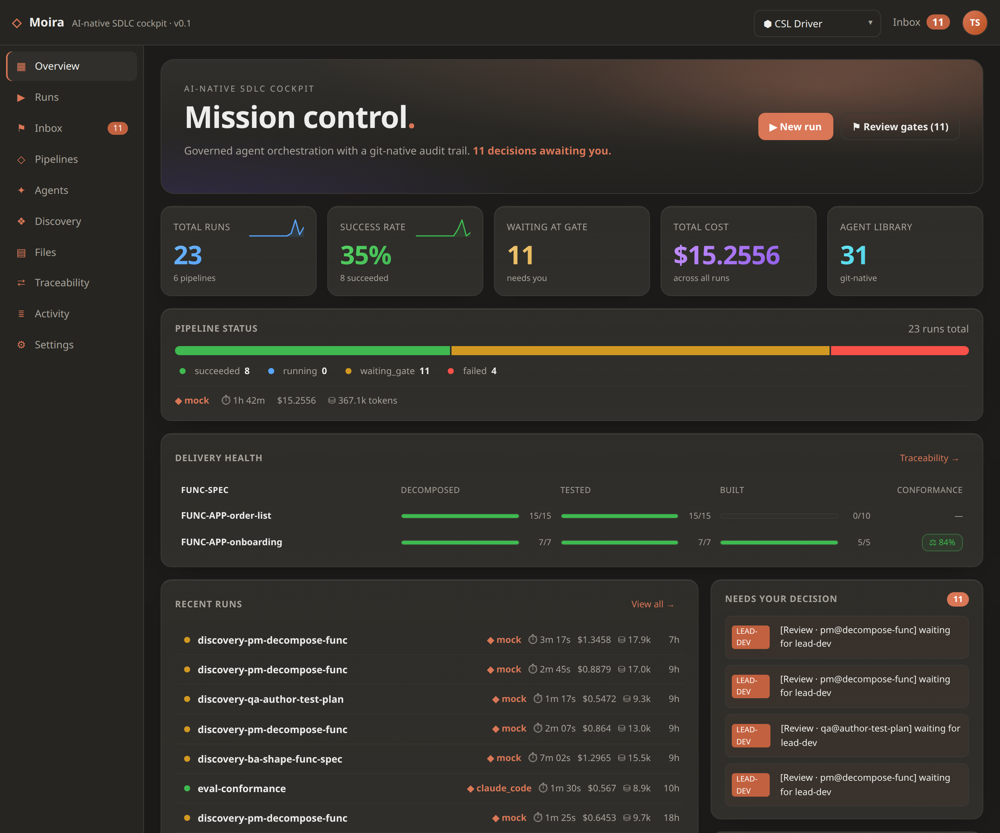
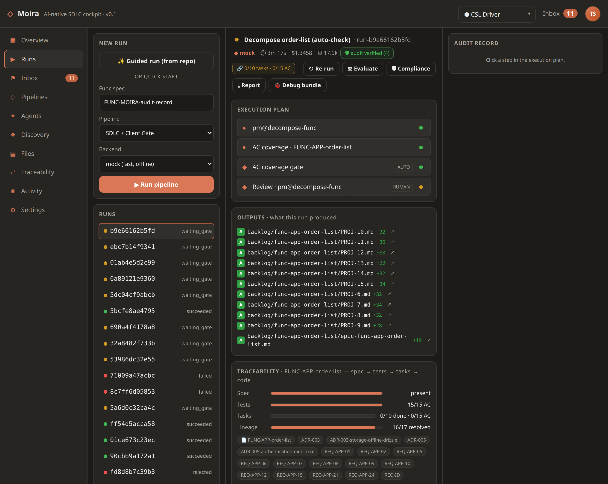
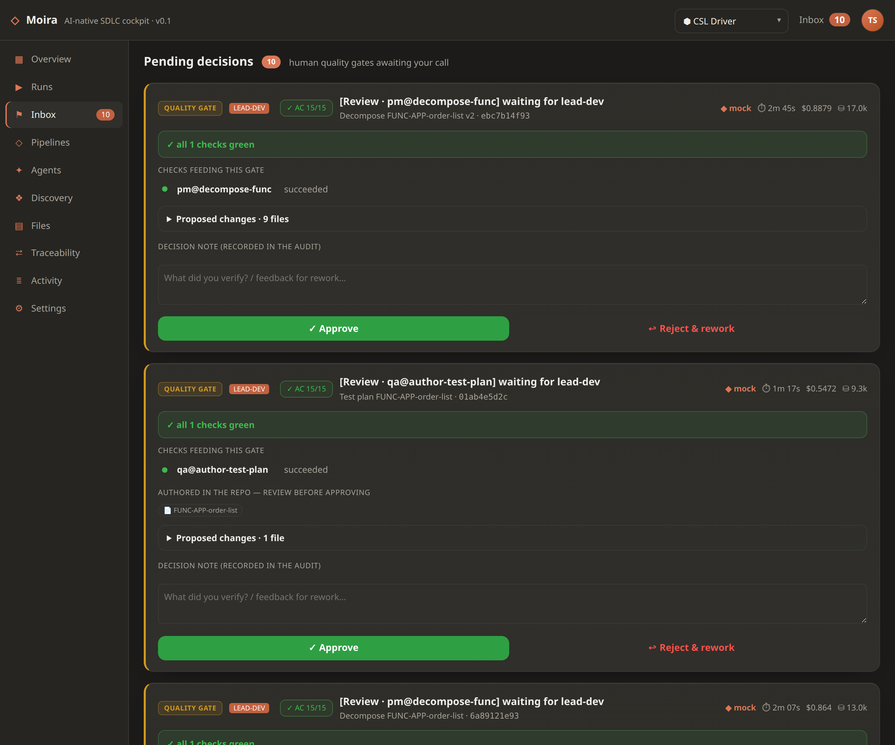
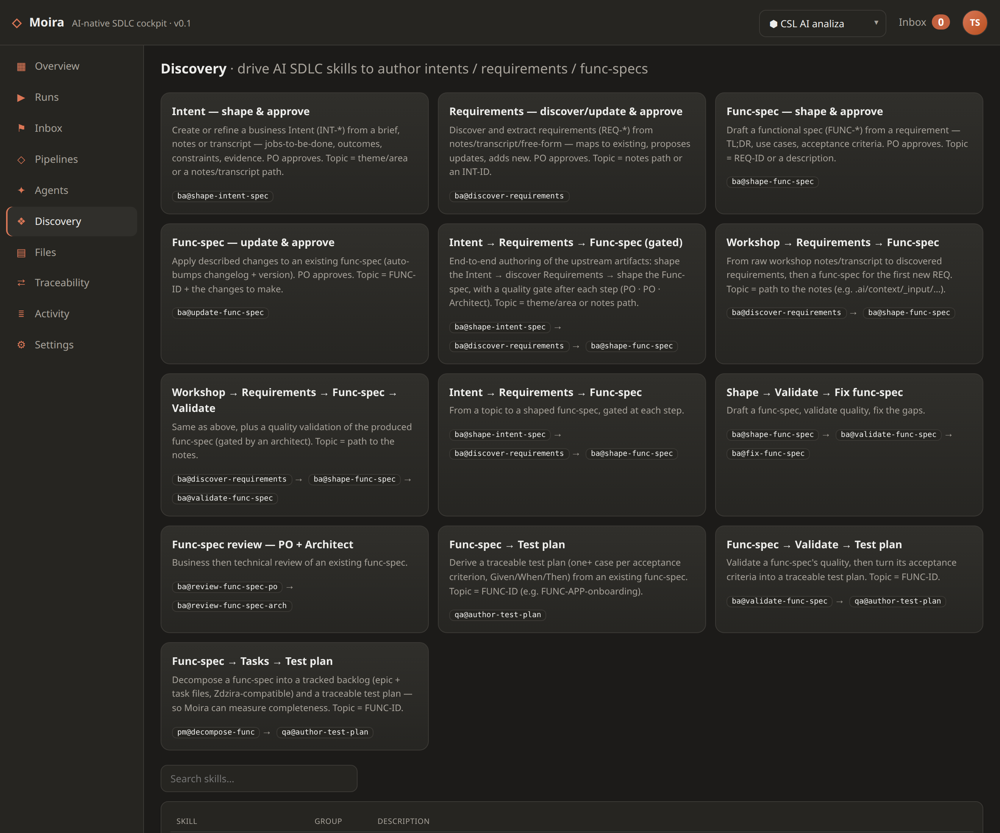

<p align="center">
  
</p>

# Moira

[](https://github.com/hycomsa/moira/actions/workflows/ci.yml)
[](LICENSE)

AI-native SDLC cockpit — a **governed orchestration layer above** best-of-breed agent backends.

> ### The speed of AI. The calm of someone who has the proof.
> Moira drives AI agents across the whole lifecycle — **intent → requirements → design → code → QA → deploy** —
> behind human quality gates, with a git-native, tamper-evident decision trail and model-agnostic execution.
> It doesn't re-implement an agent harness; it **orchestrates** pluggable frontier backends (Claude Code CLI,
> OpenAI Codex CLI, direct API) and adds the governance, traceability and cockpit layer on top.

**See it:** [marketing one-pager](docs/moira-landing.en.html) · **Run it:** [`USER_GUIDE.md`](USER_GUIDE.md) · **Build it:** [`CONTRIBUTING.md`](CONTRIBUTING.md)



<p align="center"><sub><i>Mission control — runs, success rate, gates awaiting you, delivery-health per func-spec.</i></sub></p>

## What Moira gives you

- **Governed gates** — auto / hybrid / human, with a **decision-ready Inbox**: every gate card shows AC-coverage + conformance, and a *failed* step shows the error with a one-click jump into the run.
- **Git-native, tamper-evident audit** — every step and decision in a hash-chained trail; pluggable persistence (**SQLite / PostgreSQL / git mirror**).
- **End-to-end traceability** — **Spec ↔ Tests ↔ Tasks ↔ Code** completeness, measured deterministically from the repo, plus an optional **LLM conformance** scorecard as a second opinion.
- **Git-native task/epic backlog** — Zdzira-compatible, one markdown per ticket; `pm@decompose-func` turns a func-spec into an epic + tasks tagged by acceptance criterion. *One format, four tools.*
- **Deterministic quality gates** — `AUTO_CHECK` nodes: `ac_coverage` (every AC has a task) and `test_exec` (the test suite actually passes) — escalate to a human on a gap.
- **Delivery-health dashboard** — per-FUNC decomposed / tested / built / conformance across the whole repo, in one view.
- **Discovery (BA mode)** — drive AI SDLC skills to author intents / requirements / func-specs, gated at each step — as guided presets *or* as a real pipeline.
- **Model-agnostic, anywhere** — Claude Code CLI · LiteLLM (frontier + local, anti-lock-in) · Codex CLI. **Desktop · web · mobile** (gate inbox at `/m`).

## What it looks like


<p align="center"><sub><i>A run: the execution plan + AUTO_CHECKs, the outputs it produced, and Spec ↔ Tests ↔ Tasks ↔ Code traceability.</i></sub></p>


<p align="center"><sub><i>Decision-ready Inbox — AC-coverage chip, the checks feeding the gate, the diff, Approve / Reject &amp; rework.</i></sub></p>


<p align="center"><sub><i>Discovery — drive AI SDLC skills to author intents / requirements / func-specs, gated at each step.</i></sub></p>

> **One repo.** This is the whole Moira product: `orchestrator/` (Python sidecar) + `cockpit/` (React/TS) +
> `src-tauri/` (desktop shell). The AI SDLC framework content (intents, requirements, specs, agents, skills)
> and any target application code live in **separate** repositories Moira reads/writes as a *workspace*.

**Status — v0.1 · 138 unit tests green · proven end-to-end on a real project (CSL Driver).**

## Getting started

**New here? Read [`USER_GUIDE.md`](USER_GUIDE.md)** — how to run Moira, load/create an AI SDLC repo, create a workspace, define agents, build pipelines, and run them.

## Run the cockpit

```bash
# web cockpit (no Tauri needed) — builds frontend, serves it + API on one origin
./run-cockpit.sh                 # -> http://127.0.0.1:8765

# dev mode (hot reload): two terminals
python3 orchestrator/moira_api.py --repo ../ai-sdlc      # API on :8765
npm --prefix cockpit run dev                              # UI on :5173 (proxies /api)

# desktop shell (needs tauri-cli + webkit2gtk)
cargo tauri dev
```

## Architecture

```
Tauri Shell (Rust) + React UI   ← cockpit (web or desktop) + mobile gate inbox (/m)
        │ HTTP
Python orchestration sidecar    ← own DAG engine, gates, audit (hash-chain),
        │ delegates each node to    pluggable persistence (SQLite/Postgres/git)
Execution layer (pluggable)     ← Claude Code CLI · LiteLLM (frontier/local) · Codex CLI
```

Key decisions:
- **ADR-002** — own dependency-free DAG engine (LangGraph deferred)
- **ADR-003** — LiteLLM for model-agnostic routing (frontier-first, local as anti-lock-in)
- **ADR-004** — DEV execution is delegated, not re-implemented
- **ADR-005** — pluggable run/audit persistence (primary store + export sinks)

## Repository layout

```
orchestrator/   Python sidecar — DAG engine, gates, audit (hash chain), pluggable
                persistence (SQLite/Postgres/git), HTTP API, backends (mock/claude_code/litellm)
cockpit/        React + TypeScript + Vite frontend (+ mobile gate inbox)
src-tauri/      Tauri v2 desktop shell (spawns the sidecar)
docs/           Marketing landing pages (PL + EN)
```

See [`CONTRIBUTING.md`](CONTRIBUTING.md) for how to run, test and build.

## Source of truth

Project context, intents, requirements, specs, ADRs, standards live in a **separate AI SDLC
repo** that you point a workspace at (e.g. `--repo /path/to/ai-sdlc`).

## Why build-own

Hycom owns the tooling: no per-seat license fees, full control, on-prem. GitLab Duo and exAI Cloud are reference designs, not vendors we pay.

## License

Apache License 2.0 — see [`LICENSE`](LICENSE) and [`NOTICE`](NOTICE). © 2026 Hycom S.A.
